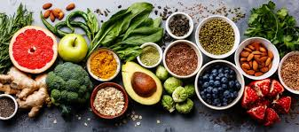

# Proyecto2

<br>



<br>

## Description

Cooking plataform where you can check recipes from other users or make your own ones. 

In this app you will find recipes from many diferent cultures and diferent flavours.

You can also save the recipes to favourites and score them. The one with higher score will be put in the hall of fame !


<br>

## User Stories

- **404** - As a user I want to see a nice 404 page when I go to a page that doesn’t exist so that I know it was my fault.
- **500** - As a user I want to see a nice error page when the super team screws it up so that I know that is not my fault.
- **homepage** - As a user I want to be able to access the homepage, see what the page is about and access to other areas of it.
- **sign up** - As a user I want to sign up on the web page so that I can personalize my profile and save information for the future.
- **login** - As a user I want to be able to log in on the web page so that I can get back to my account.
- **logout** - As a user I want to be able to log out from the web page so that I can make sure no one will access my account.
- **HallOfFame** - As a user I want to see the recipes and users most rated.
- **Recipes** - As a user I want to see the some recipes examples and be able to find more.
- **Dashboard** - As a user I want be able to create, edit or delete the recipes I created

<br>

## Server Routes (Back-end):


**Method** | **Route**                    | **Description** 
    GET         


| **Method** | **Route**                    | **Description**     

## Models

User model

```javascript
 {
    name: String,
    email: String,
    password: String,
    favourites: [{}]
  },
  {
    timestamps: true
  }
);

```

Recipes model

```javascript
{
  {
      name: String,
      ingredients: String,
      instructions: String,
      cuisine: String,
      image: {type: String, default: 'images.media-allrecipes.com/images/75131.jpg'},
      diners: Number,
      score: Number,
      creator: {type: Schema.Types.ObjectId, ref: 'User'},
      idScorer: Number
    });

```

<br>

## MVP

- Create Wildframe of all views/pages in desktop, tablet and mobile
- Identify formularies, renders, conditionals,...
- Identify the flux between all pages/views from nav, links, formularies...
- Create atleast 2 models and link them
- Use HBS with layout, pages and partials
- Routes and methods
- Req.body (POST/PUT)
- Authentication (public vs private)
- Render and redirect pages


## Backlog

- Incorporate Ingredients model to give extra resources while creating recipe, like ingredient image or category.
- Conect with product supermarket API and use them to create recipes. Calculate the price of recipe based in the product info from API

<br>

## Links

### Git

The url to your repository and to your deployed project

[Repository Link](https://github.com/GitSkynet/IronCheff)

[Deploy Link]()

<br>

### Slides

The url to your presentation slides

[Slides Link](https://docs.google.com/presentation/d/1RQLUIY-BDFEMu_HrmuHMXSfhpknRR8VYyPllry5VuN4/edit#slide=id.p)